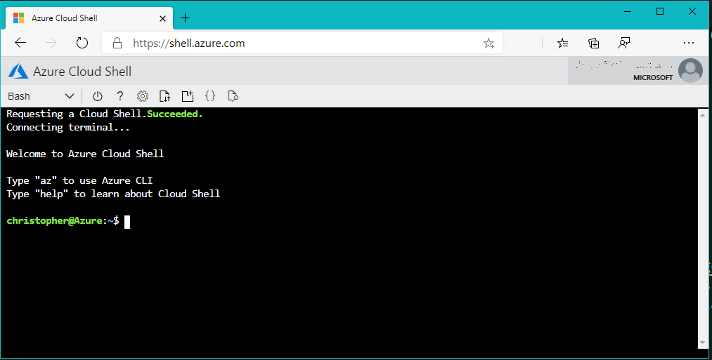

# Creating Azure resources

[Prerequisite: Exploring app.py](./explore-app-py.md)

Our scenario involves creating a web application which will use Cognitive Services. We will need a [Resource Group](#resource-group), [Cognitive Services key](#cognitive-services-key) for AI, and [App Services](#app-services) for web hosting. Let's take a look at what we're going to need on Azure to make everything happen.

> **IMPORTANT NOTE:** A little later in this exercise, you'll [run a command called `az hack`](#run-the-extension). When the command completes, **make sure you copy the output and paste it into Notepad or another location**; we'll need it to complete the rest of the course.

## Azure resources

### Resource Group

Resource groups are a key component of [resource management](https://docs.microsoft.com/azure/azure-resource-manager/resource-group-overview) in Azure. They act as containers for other Azure resources and serve to group those resources together so that you can view billing information for them as a group, apply security rules as a group, and even delete them as a group. Every Azure resource that you create must be part of a resource group.

### Cognitive Services Key

In order to use any Cognitive Service, you must first obtain an API key. This key travels in each request you place in an HTTP header named `Ocp-Apim-Subscription-Key`. It is Azure's way of authenticating the caller and determining which Azure subscription to bill calls to. Most Azure Cognitive Service APIs have free tiers for which no billing is performed, but if you plan to place thousands of calls a day to a Cognitive Services API, you will be billed for it through your Azure subscription.

You can create a separate key for each service, or create an [All-in-One](https://portal.azure.com/#create/Microsoft.CognitiveServicesAllInOne) key. The All-in-One key supports every Cognitive Service, with the exception of QnA Maker, Speech Services and Custom Vision (not to be mistaken with Computer Vision, which is what we are using). The All-in-One key is only available as a paid service at this time. If you wish to use the free tier, you will need to create a key for each service.

> **Note:** For purposes of this demo, we will be creating a single key as this is the recommended option for using Azure Cognitive Services. You can consult the [documentation for information on pricing](https://azure.microsoft.com/pricing/details/cognitive-services/). At the time of this writing, 1,000 transactions for Face API (as an example) costs $1 US; we will be executing less than 50 transactions. Your instructor will also provide a key if you so desire.

### App Services

> **NOTE:** When choosing locations, it's important to ensure all related services are created in the same location. Making calls across various Azure locations is the leading cause of poor performing applications on Azure. For our purposes, we're going to locate everything in **northcentralus**.

## Creating everything with the Azure Command-Line Interface (CLI)

If you aren't familiar with the Azure CLI, you can learn more about it and the numerous commands it supports in [Get started with Azure CLI](https://docs.microsoft.com/cli/azure/get-started-with-azure-cli?view=azure-cli-latest). Most operations in Azure can be performed by using either the CLI or the [Azure Portal](https://portal.azure.com). Power users tend to prefer the CLI, in part because CLI commands can be used in scripts to automate repetitive tasks. It is possible to [install the Azure CLI](https://docs.microsoft.com/cli/azure/get-started-with-azure-cli?view=azure-cli-latest) locally on your system, with versions available for Windows, macOS and Linux. To avoid the local installation, we're going to use the [Azure Cloud Shell](https://shell.azure.com).

### Access the Azure Cloud Shell

Open a browser, and navigate to the [Azure Cloud Shell](https://shell.azure.com), which is available at [https://shell.azure.com](https://shell.azure.com). You maybe prompted to login to your account; choose the Azure account you wish to use. After successful login, you will see the Azure Cloud Shell.



> **NOTE**: You may have multiple subscriptions for Azure associated with your account. If you aren't sure which one the Azure CLI is using, or you need to change it, you can use the following commands.

``` bash
# List all subscriptions
az account list

# Change the default (if needed)
az account set -s <SUBSCRIPTION_ID>
```

## Resource creation

To ease the creation and configuration of necessary resources, we will use an [Azure CLI extension](https://docs.microsoft.com/cli/azure/azure-cli-extensions-overview?view=azure-cli-latest) named [hack](https://github.com/microsoft/hackwithazure/blob/master/az-hack.md). The **hack** extension is designed to quickly create resources commonly used for hackathon projects or other samples. By using **hack** we can create a resource group, an instance of App Services, a database, and a key for Cognitive Services.

In addition, the tool will add all keys and values as [App Settings in the newly created web app](https://docs.microsoft.com/azure/app-service/configure-common), which can be accessed as environmental variables by your application. This allows you to easily read the values without hard coding them into your application. We'll be using [dotenv](https://github.com/theskumar/python-dotenv) to manage these values when running our application locally.

### Installing the extension

In the Cloud Shell or terminal or command window you're using to access the Azure CLI, install `az hack` by executing the following:

``` terminal
az extension add -y --source https://azhackcli.blob.core.windows.net/whl/hack-0.4.2-py2.py3-none-any.whl
```

### Run the extension

> **IMPORTANT NOTE:** When the `az hack` command completes, **copy the output and paste it into Notepad or another location**; we'll need it to complete the course.

We will execute `az hack create` by specifying a runtime of **Python**, a location of **northcentralus**, and to enable AI through Cognitive Services.

``` terminal
az hack create --name reactor --runtime python --location northcentralus --ai --output yaml
```

> **NOTE:** When choosing locations, it's important to ensure all related services are created in the same location. Making calls across various Azure locations is the leading cause of poor performing applications on Azure. For our purposes, we're going to locate everything in **northcentralus**.

#### The parameters

`az hack create` takes a series of parameters:

- `name`, which will be the root name used for all items created
- `runtime`, to indicate what runtime we'll be using for our application, such as Node.js (node) or PHP
- `ai`, to create a Cognitive Services All in One key
- `location`, to indicate the Azure region into which we want to create our resources
- `output`, which we set to **yaml**, which allows us to control the output from the command (makes it easier to copy/paste)

The utility will add five random characters to the end of the name you provide to ensure uniqueness. If you later decide you want to take your application to production, you can always upgrade the plan the App Service is running on and then [provide a custom domain](https://docs.microsoft.com/Azure/app-service/app-service-web-tutorial-custom-domain).

##### The result

What did the command do for us? Quite a bit!

- Created a [key for Cognitive Services](https://docs.microsoft.com/azure/cognitive-services/authentication), which we'll use for computer vision, translation, and facial recognition
- Website creation and configuration
  - Created a free [App Service plan](https://docs.microsoft.com/azure/app-service/overview-hosting-plans)
  - Created a [website](https://docs.microsoft.com/azure/app-service/overview) for us in App Services
  - Configured [local Git deployment](https://docs.microsoft.com/azure/app-service/deploy-local-git), which we'll use when it's time to make our website public
  - Configured [app settings](https://docs.microsoft.com/azure/app-service/configure-common), which are accessible as environmental variables in our website code

### Last steps

Make sure you copy/paste the output from the execution of `az hack`. We are going to need the information to complete the remainder of the course.

Once you have the information copied, you can **close the browser tab**, as we won't be using it for the remainder of the course. All of the remaining lab steps will be perfromed from your local system. one of the best things about Cognitive Services is the fact you're able to use the service without having to run your application on Azure (of course you can if you so desire!), and they're accessible from any type of application with internet access.

## Summary and next steps

We've explored how to create the necessary resources on Azure. Next, we'll see how we [can call Computer Vision](./computer-vision.md) from our application.
