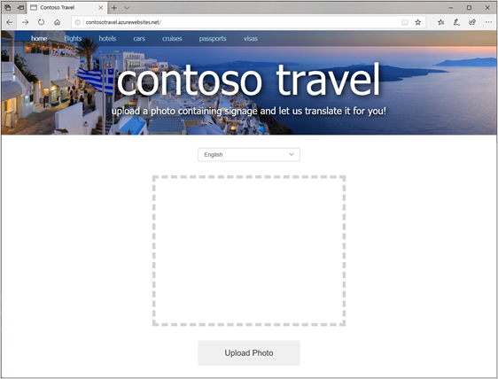

# Create an Azure App Service

[Prerequisite: Translating text](./translator.md)

[Azure App Service](https://azure.microsoft.com/documentation/articles/app-service-value-prop-what-is/) is a set of services provided by Microsoft Azure to enable developers to easily build and deploy web apps. Included in the App Service family are [Azure Web Apps](https://azure.microsoft.com/documentation/articles/app-service-web-overview/), which allow you to quickly and easily deploy websites built with tools and languages you’re already familiar with.

Azure Web Apps simplifies website deployment, and not just websites built using the Microsoft stack. You can deploy Python apps connecting to MySQL databases with the same tools you would for ASP.NET apps connecting to SQL Server databases. You can select from a wide variety of Azure Web App templates or build templates of your own. You can configure Azure Web Apps to auto-scale as traffic increases to ensure that your customers aren’t left waiting during periods of peak demand. You can [publish apps to staging locations](https://docs.microsoft.com/azure/app-service/deploy-staging-slots) and test them in the cloud before taking them live, and then swap staging and production with the click of a button. You can even create [WebJobs](https://docs.microsoft.com/azure/app-service/webjobs-create) - programs or scripts that run continuously or on a schedule to handle billing and other time-critical tasks. In short, Azure Web Apps take the pain out of publishing and maintaining web apps and are just as suitable for a personal photo-sharing site as they are for enterprise-grade sites serving millions of customers.

In this unit, you will deploy Contoso Travel to Azure as an Azure Web App so it can be accessed by anyone, from anywhere, using a browser.

## Deploying to Azure

`az hack create` configured your web app for [local Git deployment](https://docs.microsoft.com/azure/app-service/deploy-local-git). All keys are stored as [App Settings](https://docs.microsoft.com/azure/app-service/configure-common) for your website, which can be accessed by environmental variables in your application. By using local Git deployment, you are able to add your web app as a [Git remote](https://git-scm.com/book/en/v2/Git-Basics-Working-with-Remotes), meaning you can push your code to your web app in the same way you'd push your code to GitHub or another code repository.

Because the deployment is done via Git, your [.gitignore](https://git-scm.com/docs/gitignore) file will be honored. When performing the deployment, [Kudu](https://docs.microsoft.com/azure/app-service/deploy-local-git#deploy-with-kudu-build-server) will automatically install the Python packages listed in **requirements.txt**, and start the file named **app.py**. Fortunately, our application is already configured to support this!

## Performing the deployment

To deploy our application, we will add the deployment URL as a Git remote, and then execute a `git push` command to perform the deployment

### Create Git repository

1. If not already available, open a terminal or command window *on your local system* and navigate to the directory with your code (**reactors/AI_1/starter-site** is the default)
2. Run the following commands to create a Git repository and add your code

``` terminal
git init
git add .
git commit -m "Initial commit"
```

### Add Azure as a remote destination

To add your web app as a remote for your Git repository, execute the following command from the same terminal or command window. Replace `<appname>` with the name of your application, which you you can find from the output you saved when you executed [az hack create](./create-azure-resources.md#run-the-extension).

``` terminal
git remote add azure https://<appname>.scm.azurewebsites.net:443/<appname>.git
```

### Perform the deployment

We're all set and ready to deploy our application! From the same terminal or command window, use `git push` to perform the deployment. While your code is deploying, you'll see Azure creating a virtual environment, upgrading pip, and then installing all of the packages.

``` terminal
git push -u azure master
```

> **NOTE:** When you push you will be prompted for the username and password which was created by `az hack create` and displayed as part of the output. If no password was generated, you can [reset your password with Azure CLI](../computer-vision-translator/deploy.md#set-a-deployment-password)

## Run the website

Now it's time to see your site in the real world! Open your browser and navigate to **https://APP_NAME.azurewebsites.net**, replacing **APP_NAME** with the name of your application. Confirm everything is running properly.



## Final Summary

In this module, you learned the basics of building websites in Python by using the Flask framework. You learned that Python code goes typically in a file named **app.py** and, code in that file calls Flask functions such as `render_template()` and `flask()`. You also learned how to programmatically inject content into HTML templates by using Flask expressions, and how to use `@app.route()` to connect functions in your code to routes supported by the application. Finally, you learned how easy it is to use the Azure CLI's `az webapp up` command to upload a website that you have written and tested locally to an Azure App Service.

In addition, you discovered that you can use Azure Cognitive Services to build intelligent applications infused with AI. The Computer Vision API extracts text from images and identifies objects in those images, among other tasks. It can even generate captions for the images you upload. And the Translator Text API translates text among dozens of languages. Combined with other Cognitive Services, these APIs make it possible to write apps that you could only have dreamed about just a few short years ago.

## Next Steps

Congratulations! You have created an app app which will allow a user to upload an image, detect and translate the text! Next we will explore adding [face detection to the app](../face-api/README.md).
