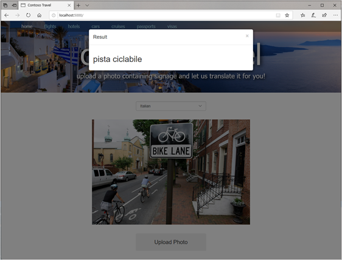

# Use Azure Cognitive Services to translate text

[Prerequisites: Add Computer Vision](./computer-vision.md)

The [Translator Text API](https://azure.microsoft.com/services/cognitive-services/translator-text-api/) is the component of Azure Cognitive Services that translates text from one language to another. It relies on state-of-the-art [Neural Machine Translation (NMT)](https://www.microsoft.com/translator/business/machine-translation/#nmt) to work its magic and supports [more than 60 languages](https://docs.microsoft.com/azure/cognitive-services/translator/language-support).

Like the Computer Vision API, the Translator Text API is invoked using REST calls over the Internet. Unlike the Computer Vision API, the Translator Text API currently has no Python SDK available. That doesn’t mean that you can’t use it from a Python application. It means that you must invoke the API by using raw HTTPS requests and write code to parse the JSON payloads that are returned.

It’s not as hard as it sounds, as you will prove when you modify the Contoso Travel site to pass text extracted from photos by the Computer Vision API to the Translator Text API for translation into another language.

## Modify the site to use the Translator Text API

You have now subscribed to the Translator Text API and obtained an API key for calling it. The next step is to modify the Contoso Travel site to use the Translator Text API to translate text extracted from photos with the Computer Vision API.

### Add translate_text helper function

Let's add a helper function named `translate_text()` to the end of **app.py**. This function will call the REST endpoint.

``` python
def translate_text(lines, target_language, key, region):
    uri = "https://api.cognitive.microsofttranslator.com/translate?api-version=3.0&to=" + target_language

    headers = {
        'Ocp-Apim-Subscription-Key': key,
        'Ocp-Apim-Subscription-Region': region,
        'Content-type': 'application/json'
    }

    input=[]

    for line in lines:
        input.append({ "text": line })

    try:
        response = requests.post(uri, headers=headers, json=input)
        response.raise_for_status() # Raise exception if call failed
        results = response.json()

        translated_lines = []

        for result in results:
            for translated_line in result["translations"]:
                translated_lines.append(translated_line["text"])

        return translated_lines

    except requests.exceptions.HTTPError as e:
        return ["Error calling the Translator Text API: " + e.strerror]

    except Exception as e:
        return ["Error calling the Translator Text API"]
```

#### Breaking down the code

``` python
uri = "https://api.cognitive.microsofttranslator.com/translate?api-version=3.0&to=" + target_language
```

We start by setting the URI for the translator service and specifying our language in the query string. We don't need to specify the source language as it will be automatically detected by the service.

``` python
headers = {
    'Ocp-Apim-Subscription-Key': key,
    'Ocp-Apim-Subscription-Region': region,
    'Content-type': 'application/json'
}
```

We then set up a dictionary called `headers`, which will store the key, the region the key is located in, and the return type (JSON).

``` python
for line in lines:
    input.append({ "text": line })
```

The API expects each line as an object with a single property called `text`. This section handles that conversion.

``` python
response = requests.post(uri, headers=headers, json=input)
response.raise_for_status() # Raise exception if call failed
results = response.json()

translated_lines = []

for result in results:
    for translated_line in result["translations"]:
        translated_lines.append(translated_line["text"])

return translated_lines
```

We then use [Requests](https://2.python-requests.org/en/master/), the de facto standard for Python for making HTTP(S) calls. `post` indicates a POST call, and we specify the `uri` to call, our `headers`, which contains the key, and `json`, which is the text we wish to have translated. We specify we want errors to be raised if we don't receive a 200 response by calling `raise_for_status()`. Finally, we retrieve the results by calling `json()`.

Similar to before, we loop through the results and append them to a list called `translated_lines`, and return the value.

### Update translate to call our new helper function

With the helper function created, let's update `translate()` to call the new `translate_text` function. Inside `translate`, just below the comment which says `# TODO: Add code to translate text`, add the following code:

``` python
    # TODO: Add code to translate text
    messages = translate_text(messages, target_language, COGSVCS_KEY, COGSVCS_REGION)
```

> **NOTE:** The tab at the beginning of the line of code is required. Python uses tab levels to identify enclosures, and we want to put the call to `extract_text_from_message` inside `index`. It should be in line with the existing comment.

We pass in the lines of code we wish to translate, which is stored in `messages`, and then the code of the language we want to target for translation. As mentioned before, the source language will be detected automatically.

## Test the site

The last (and best?) step is to test our changes! From the home page select **Translate a sign** or navigate to **http://localhost:5000/translate**. It should look something like this:


Select the target language for translation (the language you want to translate **to**). Select an image with text, and then click **Upload Photo**. You should see the translated text in the dialog box!



## Summary and next steps

Congratulations! You've now built a fully function translation site!

You may notice some of the translations aren't as accurate as one might like. Performing translations is a challenging problem. Various idioms aren't always picked up well by automated services, and context is often lacking. But the service should provide a serviceable translation. One we should be willing to [deploy and share](./deploy.md)!
