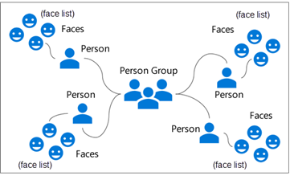
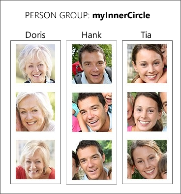
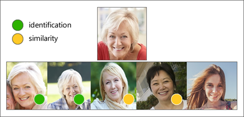

# Overview of facial recognition

[Prerequisite: Overview of Face API](./introduction.md)

The face-detection feature of Face API provides information about detected faces in an image, but it isn't designed to identify or recognize a specific face. However, Face API offers this capability through a facial recognition feature.

Facial recognition is used in many areas, including security, natural user interfaces, image analysis, mobile apps, and robotics. The ability to use artificial intelligence to recognize and match faces is one of the more powerful aspects of Face API. It is also an aspect of AI which encapsulates many ethical questions, which we will discuss later in this section.

## Facial detection vs facial recognition

Facial recognition builds on the facial detection functionality by analyzing the landmarks in two or more pictures to determine whether the same face is present. There are four assessments which can be determined:

- Does this person look like other people? (Similarity)
- Do all these faces belong together? (Grouping)
- Do two images of a face belong to the same person? (Verification)
- Who is this person in this group of people? (Identification)

## Training facial recognition

In order to identify faces, Face API needs to be trained. When setting up Face API for recognition, you will create a Person Group, one or more Persons, and Faces.

### Person Group

A person group is a collection of people you wish to identify. Facial recognition works in a closed universe; it is only able to identify the people and faces you've trained. By creating person groups, you can create separate models for facial recognition, and manage each one individually. A person group has a name and ID which you provide (these can be the same), and contains one or more persons.

### Person

A person is someone you wish to identify in the group. A person has a name (as you might have expected), and a collection of faces known as a face list.

### Face

A face is an image of the person you wish to use to train the model. When uploading images, ensure there is only one person in the photo. You will also want to ensure you train the model with multiple images of the person, in different lighting and settings.

## Face identification

You can use Face API to identify people by comparing a detected face to a person group. Remember, the person group is like a database of people, and only people in the database will be identified. You might train up a model with three people like demonstrated below.

## Face similarity

Face lists are a great way to determine face similarity. For example, if you compare a target face against a face list, Face API might return a small collection of faces which look similar to the target face. Face API supports two working modes:

- **Match person**, which returns similar faces after applying a same-person threshold derived from face verification
- **Match face**, which returns similar faces by ignoring the same-person threshold

## Summary and next steps

After training a model, Face API can offer you quite a bit of information about the people in a photograph. Let's see how we [configure Face API for our account and train a model](./train-face-api.md).
