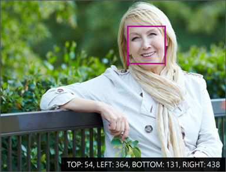
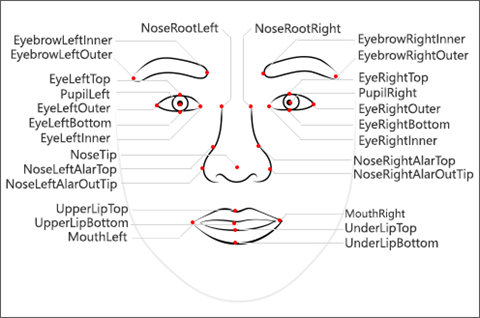
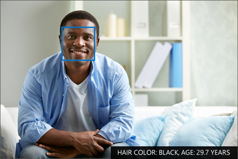

# The Face API: How it works

[Prerequisites: Module overview](./README.md)

As a developer, you interact with Microsoft's facial recognition algorithms through an API. As with all other Microsoft Cognitive Services, Face API is available via a REST-based web service, allow you to detect, verify, identify and analyze faces. The service can provide face matching and characteristic analysis. It can also extract face related attributes such as emotion, or group people and facial definitions together to locate similar faces.

The tasks performed by Face API fall into five categories:

- **Detection**: Detect the existence and location of faces in an image
- **Similarity**: Find similar faces in an image
- **Grouping**: Organize unidentified faces into groups based on their visual similarity
- **Identification**: Search and identify faces

## Types of facial data

Face API returns three kinds of facial data: the locations, the landmarks (such as ears and nose), and the attributes (such as emotion).

### Location

A face location is the coordinates of where a face has been identified in an image. The location is a rectangular pixel area in the image. The coordinates consist of top, left, bottom, and right edges of the region which contains the face.

### Landmarks

Face landmarks are the detailed points on a face. Collections of these points (such as the chart below) provide rough sketches of individual human faces. These landmarks identify common facial elements, such as a pupil, nose or eyebrow, by using pixel coordinates. Face API can return up to 27 landmarks for each identified face, all of which can be used for analysis.

### Attributes

Face attributes are predefined properties of a face or properties that identify a person by a face. The API can optionally identify the following types of attributes:

- Age
- Gender
- Smile intensity
- Facial hair
- Head pose (3D)
- Emotion

## Summary and next steps

Face API is an extremely powerful Cognitive Service. Without any additional training, you can learn quite a bit about a face in an image. You can also begin to add your own training data to [recognize individual people](./facial-recognition-concepts.md).
