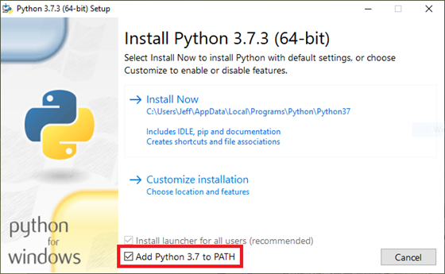

# Install Python

If Python 3.6 or higher isn't already installed on your computer, you can install it by visiting [python.org](https://python.org) and following the installation steps. If you're not sure if it's installed, you can test it by running the following command. If Python is installed the version number will appear in the console window.

``` bash
# Windows
python --version

# macOS or Linux
python3 --version
```

> **Note** If you do need to install Python, ensure you select the option to *Add Python 3.x to PATH*



## Upgrading pip

[pip](https://pypi.org/) is the package manager for Python. You should always ensure you have the latest version of `pip`. To perform the upgrade, you can issue the following command:

``` bash
# Windows
python -m pip install --upgrade pip

# macOS or Linux
python3 -m pip install --upgrade pip
```

## Next steps

If you're following along, the next step is to [install the starter site](./install-starter.md).
